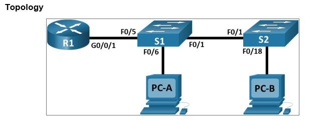
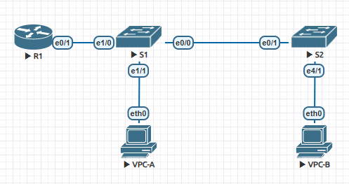

# Configure Router-on-a-Stick Inter-VLAN Routing

## Задачи:
 1. Создать сеть на основе топологии;
 2. Создать VLAN и назначить на порты коммутаторов;
 3. Настройка транка 802.1Q между коммутаторами:
 4. Настроить маршрутизацию между VLAN на маршрутизаторе;
 5. Проверить работу маршрутизации между VLAN;  

 ## Конфигурации:  
  - [Конфигурация R1](config-R1);  
  - [Конфигурация S1](config-S1);  
  - [Конфигурация S2](config-S2);  
  
##  Решение:
 1. Топология из задания:  
   
 Топология созданная в EVE-NG:  
     
 
 Таблица адресов:  
| Device     | Interface Topology - EVE-NG  | IP Address   | Subnet Mask   | Default Gateway  |
|:----------:|:----------------------------:|:------------:|:-------------:|:----------------:|
| R1         | G0/0/1.3 - E0/1.3            | 192.168.3.1  | 255.255.255.0 | N/A              |
|            | G0/0/1.4 - E0/1.4            | 192.168.4.1  | 255.255.255.0 | N/A              |
|            | G0/0/1.8 - E0/1.8            | N/A          | N/A           | N/A              |
| S1         | VLAN3 - VLAN3                | 192.168.3.11 | 255.255.255.0 | 192.168.3.1      |
| S2         | VLAN3 - VLAN3                | 192.168.3.12 | 255.255.255.0 | 192.168.3.1      |
| PC-A       | NIC - NIC                    | 192.168.3.3  | 255.255.255.0 | 192.168.3.1      |
| PC-B       | NIC - NIC                    | 192.168.4.3  | 255.255.255.0 | 192.168.4.1      |  

VLAN Таблица:  

| VLAN | NAME       | Interface Assigned Topology - EVE-NG                              |
|:----:|:----------:|:-----------------------------------------------------------------:|
| 3    | Management | S1: VLAN3 - VLAN3                                                 |
|      |            | S2: VLAN3 - VLAN3                                                 |
|      |            | S1: F0/6 - E1/0                                                   |
| 4    | Operations | S2: F0/18 = E4/1                                                  |
| 7    | ParkinkLot | S1: F0/2-4 - E0/1-E0/3, F0/7-24 - E1/2-E5/3, G0/1-2 - N/A         |
|      |            | S2: F0/2-17 - E0/0, E0/2-E4/0, F0/19-24 - E4/2-E5/3, G0/1-2 - N/A |
| 8    | Native     | N/A                                                               |  

Trunk Таблица:  

| Device |Trunk Interface Topology - EVE-NG |
|:------:|:--------------------------------:|
| S1     | F0/1, F0/5 - E0/0, E1/0          |
| S2     | F0/1 - E0/1                      |  


 2. Создание VLAN и их назначение на коммутаторах:  

```
S1#sh vlan brief

VLAN Name                             Status    Ports
---- -------------------------------- --------- -------------------------------
1    default                          active
3    Management                       active    Et1/1
4    Operations                       active
7    ParkingLot                       active    Et0/1, Et0/2, Et0/3, Et1/2
                                                Et1/3, Et2/0, Et2/1, Et2/2
                                                Et2/3, Et3/0, Et3/1, Et3/2
                                                Et3/3, Et4/0, Et4/1, Et4/2
                                                Et4/3, Et5/0, Et5/1, Et5/2
                                                Et5/3
8    Native                           active
1002 fddi-default                     act/unsup
1003 token-ring-default               act/unsup
1004 fddinet-default                  act/unsup
1005 trnet-default                    act/unsup
```