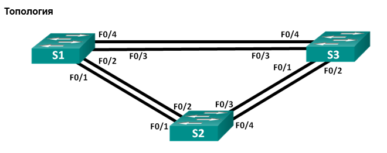
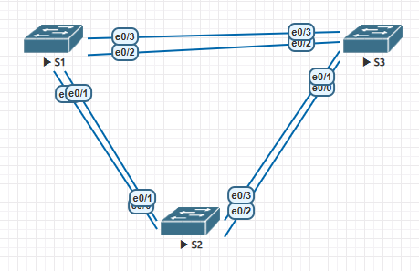

# Развертывание коммутируемой сети с резервными каналами  

## Задачи:  
Часть 1. Создание сети и настройка основных параметров устройства.  
Часть 2. Выбор корневого моста.  
Часть 3. Наблюдение за процессом выбора протоколом STP порта, исходя из стоимости портов.  
Часть 4. Наблюдение за процессом выбора протоколом STP порта, исходя из приоритета портов.  

## Конфигурации
- [Конфигурация S1](config-S1);  
- [Конфигурация S2](config-S2);  
- [Конфигурация S3](config-S3);  

# Решение:  
Часть 1.  
Топология из задания:  
   
 Топология созданная в EVE-NG:  
     

  Таблица адресов:  
| Device | Interface | IP Address   | Subnet Mask   | 
|:------:|:---------:|:------------:|:-------------:|
| S1     | VLAN1     | 192.168.1.1  | 255.255.255.0 | 
| S2     | VLAN1     | 192.168.1.2  | 255.255.255.0 |
| S3     | VLAN1     | 192.168.1.3  | 255.255.255.0 |  

Таблица соотвествия портов Топология - EVE-NG:  
| Topology Interface | EVE-NG Interface | 
|:------------------:|:----------------:|
| F0/1               | E0/0             | 
| F0/2               | E0/1             |
| F0/3               | E0/2             |
| F0/4               | E0/3             |  

Топология создана (конфигурации выше), проверка связности устройств:  
- S1<-->S2:  
```
S1#ping 192.168.1.2
Type escape sequence to abort.
Sending 5, 100-byte ICMP Echos to 192.168.1.2, timeout is 2 seconds:
.!!!!
Success rate is 80 percent (4/5), round-trip min/avg/max = 1/1/1 ms
```  

- S1<-->S3:  
```
S1#ping 192.168.1.3
Type escape sequence to abort.
Sending 5, 100-byte ICMP Echos to 192.168.1.3, timeout is 2 seconds:
.!!!!
Success rate is 80 percent (4/5), round-trip min/avg/max = 1/1/1 ms
```  

- S2<-->S3:  
```
S2#ping 192.168.1.3
Type escape sequence to abort.
Sending 5, 100-byte ICMP Echos to 192.168.1.3, timeout is 2 seconds:
.!!!!
Success rate is 80 percent (4/5), round-trip min/avg/max = 2/3/4 ms
```  
Часть 2. Вывод STP и схема:  

S1:  
```
S1#sh spanning-tree

VLAN0001
  Spanning tree enabled protocol ieee
  Root ID    Priority    32769
             Address     aabb.cc00.1000
             This bridge is the root
             Hello Time   2 sec  Max Age 20 sec  Forward Delay 15 sec

  Bridge ID  Priority    32769  (priority 32768 sys-id-ext 1)
             Address     aabb.cc00.1000
             Hello Time   2 sec  Max Age 20 sec  Forward Delay 15 sec
             Aging Time  300 sec

Interface           Role Sts Cost      Prio.Nbr Type
------------------- ---- --- --------- -------- --------------------------------
Et0/1               Desg FWD 100       128.2    Shr
Et0/3               Desg FWD 100       128.4    Shr
```  
S2:
```
S2#sh spanning-tree

VLAN0001
  Spanning tree enabled protocol ieee
  Root ID    Priority    32769
             Address     aabb.cc00.1000
             Cost        100
             Port        2 (Ethernet0/1)
             Hello Time   2 sec  Max Age 20 sec  Forward Delay 15 sec

  Bridge ID  Priority    32769  (priority 32768 sys-id-ext 1)
             Address     aabb.cc00.2000
             Hello Time   2 sec  Max Age 20 sec  Forward Delay 15 sec
             Aging Time  300 sec

Interface           Role Sts Cost      Prio.Nbr Type
------------------- ---- --- --------- -------- --------------------------------
Et0/1               Root FWD 100       128.2    Shr
Et0/3               Desg FWD 100       128.4    Shr
```  
S3:  
```
S3#sh spanning-tree

VLAN0001
  Spanning tree enabled protocol ieee
  Root ID    Priority    32769
             Address     aabb.cc00.1000
             Cost        100
             Port        4 (Ethernet0/3)
             Hello Time   2 sec  Max Age 20 sec  Forward Delay 15 sec

  Bridge ID  Priority    32769  (priority 32768 sys-id-ext 1)
             Address     aabb.cc00.3000
             Hello Time   2 sec  Max Age 20 sec  Forward Delay 15 sec
             Aging Time  300 sec

Interface           Role Sts Cost      Prio.Nbr Type
------------------- ---- --- --------- -------- --------------------------------
Et0/1               Altn BLK 100       128.2    Shr
Et0/3               Root FWD 100       128.4    Shr
```  
