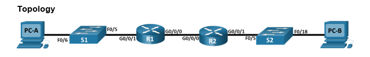
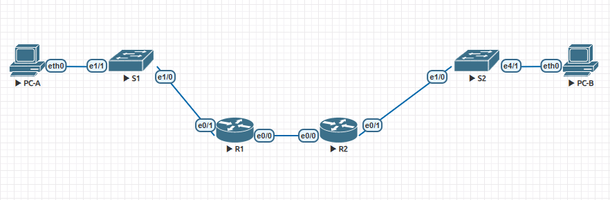

# Implement DHCPv4  

## Задачи:  
 1. Создать сеть на основе топологии и произвести базовые настройки;  
 2. Настроить 2 DHCPv4 сервера на R1;  
 3. Настроить DHCP Relay на R2 и проверить.  

# Решение:  
  1. Топология из задания:  
    
  Топология созданная в EVE-NG:  
    

Подсети:  

Subnet A:  
Network: 192.168.1.0  
Bitmask: 255.255.255.192 (26)  
Broadcast: 192.168.1.63  
Min host: 192.168.1.1  
Max host: 192.168.1.62  

Subnet B:  
Network: 192.168.1.64  
Bitmask: 255.255.255.224 (27)  
Broadcast: 192.168.1.95  
Min host: 192.168.1.65  
Max host: 192.168.1.94  

Subnet C:  
Network: 192.168.1.96  
Bitmask: 255.255.255.240 (28)  
Broadcast: 192.168.1.111  
Min host: 192.168.1.97  
Max host: 192.168.1.110  

Таблица адресов:  

| Device     | Interface Topology - EVE-NG  | IP Address   | Subnet Mask     | Default Gateway  |
|:----------:|:----------------------------:|:------------:|:---------------:|:----------------:|
| R1         | G0/0/0/ - E0/0               | 10.0.0.1     | 255.255.255.252 | N/A              |
|            | G0/0/1 - E0/1                | N/A          | N/A             | N/A              |
|            | G0/0/1.100 - E0/1.100        | 192.168.1.1  | 255.255.255.192 | N/A              |
|            | G0/0/1.200 - E0/1.200        | 192.168.1.65 | 255.255.255.224 | N/A              |
|            | G0/0/1.1000 - E0/1.1000      | N/A          | N/A             | N/A              |
| R2         | G0/0/0 - E0/0                | 10.0.0.2     | 255.255.255.252 | N/A              |
| R2         | G0/0/1 - E0/1                | 192.168.1.97 | 255.255.255.240 | N/A              |
| S1         | VLAN200 - VLAN200            | 192.168.1.66 | 255.255.255.224 | 192.168.1.65     |
| S2         | VLAN1 - VLAN1                | 192.168.1.98 | 255.255.255.240 | 192.168.1.97     |
| PC-A       | NIC - NIC                    | DHCP         | DHCP            | DHCP             |
| PC-B       | NIC - NIC                    | DHCP         | DHCP            | DHCP             |  

VLAN Таблица:  

| VLAN | NAME       | Interface Assigned Topology - EVE-NG                              |
|:----:|:----------:|:-----------------------------------------------------------------:|
| 1    | N/A        | S2: F0/18 - E4/1                                                  |
| 100  | Clients    | S1: F0/6 - E1/0                                                   |
| 200  | Management | S1: VLAN200 - VLAN200                                             |
| 999  | Parking_Lot| S1: F0/1-4 - E0/0-3, F0/7-24 - E1/2-5/3                           |
| 1000 | Native     | N/A                                                               |  

Trunk Таблица:  

| Device |Trunk Interface Topology - EVE-NG |
|:------:|:--------------------------------:|
| S1     | F0/5 - E1/0                      |
| S2     | F0/5 - E1/0                      |  

Проверка связонности:  

R1<-->S1:  
```
R1# ping 192.168.1.66
Type escape sequence to abort.
Sending 5, 100-byte ICMP Echos to 192.168.1.66, timeout is 2 seconds:
!!!!!
Success rate is 100 percent (5/5), round-trip min/avg/max = 1/1/1 ms
```  
S1<-->R1:  
```
S1#ping 192.168.1.65
Type escape sequence to abort.
Sending 5, 100-byte ICMP Echos to 192.168.1.65, timeout is 2 seconds:
!!!!!
Success rate is 100 percent (5/5), round-trip min/avg/max = 1/3/6 ms
```  
R2<-->S2:  
```
R2#ping 192.168.1.98
Type escape sequence to abort.
Sending 5, 100-byte ICMP Echos to 192.168.1.98, timeout is 2 seconds:
!!!!!
Success rate is 100 percent (5/5), round-trip min/avg/max = 1/1/1 ms
```  
S2<-->R2:  
```
S2#ping 192.168.1.97
Type escape sequence to abort.
Sending 5, 100-byte ICMP Echos to 192.168.1.97, timeout is 2 seconds:
!!!!!
Success rate is 100 percent (5/5), round-trip min/avg/max = 1/1/1 ms
```  

Настройка статической маршрутизации на R1 и R2:  

R1:  
```
ip route 0.0.0.0 0.0.0.0 10.0.0.2
```  

R2:  
```
ip route 0.0.0.0 0.0.0.0 10.0.0.1
```  

Проверка маршрутиазции R1<-->R2:  
```
R1(config)#do ping 192.168.1.97
Type escape sequence to abort.
Sending 5, 100-byte ICMP Echos to 192.168.1.97, timeout is 2 seconds:
!!!!!
Success rate is 100 percent (5/5), round-trip min/avg/max = 1/1/1 ms
```  

2. Настройка двух DHCP-серверов на R1:  

```
R1#sh running-config | b dhcp
ip dhcp excluded-address 192.168.1.1 192.168.1.5
ip dhcp excluded-address 192.168.1.97 192.168.1.101
!
ip dhcp pool R1_Client_VLAN100
 network 192.168.1.0 255.255.255.192
 default-router 192.168.1.1
 domain-name ccna.lab.com
 lease 2 12 30
!
ip dhcp pool R2_Client_LAN
 network 192.168.1.96 255.255.255.240
 default-router 192.168.1.97
 domain-name ccna.lab.com
 lease 2 12 30
!
``` 
```
R1#sh ip dhcp pool

Pool R1_Client_VLAN100 :
 Utilization mark (high/low)    : 100 / 0
 Subnet size (first/next)       : 0 / 0
 Total addresses                : 62
 Leased addresses               : 1
 Pending event                  : none
 1 subnet is currently in the pool :
 Current index        IP address range                    Leased addresses
 192.168.1.7          192.168.1.1      - 192.168.1.62      1

Pool R2_Client_LAN :
 Utilization mark (high/low)    : 100 / 0
 Subnet size (first/next)       : 0 / 0
 Total addresses                : 14
 Leased addresses               : 0
 Pending event                  : none
 1 subnet is currently in the pool :
 Current index        IP address range                    Leased addresses
 192.168.1.97         192.168.1.97     - 192.168.1.110     0
```  
```
R1#sh ip dhcp binding
Bindings from all pools not associated with VRF:
IP address          Client-ID/              Lease expiration        Type
                    Hardware address/
                    User name
192.168.1.6         0100.5079.6668.01       Mar 26 2025 04:47 AM    Automatic
``` 

```
R1#sh ip dhcp server statistics
Memory usage         33638
Address pools        2
Database agents      0
Automatic bindings   1
Manual bindings      0
Expired bindings     0
Malformed messages   0
Secure arp entries   0

Message              Received
BOOTREQUEST          0
DHCPDISCOVER         2
DHCPREQUEST          1
DHCPDECLINE          0
DHCPRELEASE          0
DHCPINFORM           0

Message              Sent
BOOTREPLY            0
DHCPOFFER            1
DHCPACK              1
DHCPNAK              0
```  
Проверка получения IP-адреса от DHCP сервера и провекра связанности:  

PC-A:  
```
PC-A> dhcp
DDORA IP 192.168.1.6/26 GW 192.168.1.1
```  
```
PC-A> ping 192.168.1.1

84 bytes from 192.168.1.1 icmp_seq=1 ttl=255 time=0.601 ms
84 bytes from 192.168.1.1 icmp_seq=2 ttl=255 time=1.807 ms
84 bytes from 192.168.1.1 icmp_seq=3 ttl=255 time=1.282 ms
84 bytes from 192.168.1.1 icmp_seq=4 ttl=255 time=0.576 ms
84 bytes from 192.168.1.1 icmp_seq=5 ttl=255 time=0.837 ms
```  

3. Настройка DHCP-Relay на R2:  

R2:
```
interface Ethernet0/1
 ip address 192.168.1.97 255.255.255.240
 ip helper-address 10.0.0.1
```

PC-B:  
```
PC-B> dhcp
DDORA IP 192.168.1.104/28 GW 192.168.1.97
```  
```
PC-B> ping 192.168.1.97

84 bytes from 192.168.1.97 icmp_seq=1 ttl=255 time=1.678 ms
84 bytes from 192.168.1.97 icmp_seq=2 ttl=255 time=0.882 ms
84 bytes from 192.168.1.97 icmp_seq=3 ttl=255 time=0.682 ms
84 bytes from 192.168.1.97 icmp_seq=4 ttl=255 time=1.481 ms
84 bytes from 192.168.1.97 icmp_seq=5 ttl=255 time=1.192 ms
```  

```
R1#show ip dhcp binding
Bindings from all pools not associated with VRF:
IP address          Client-ID/              Lease expiration        Type
                    Hardware address/
                    User name
192.168.1.6         0100.5079.6668.01       Mar 26 2025 04:47 AM    Automatic
192.168.1.104       0100.5079.6668.02       Mar 26 2025 05:38 AM    Automatic
```  

```
R1#show ip dhcp server statistics
Memory usage         58481
Address pools        2
Database agents      0
Automatic bindings   2
Manual bindings      0
Expired bindings     2
Malformed messages   0
Secure arp entries   0

Message              Received
BOOTREQUEST          0
DHCPDISCOVER         19
DHCPREQUEST          2
DHCPDECLINE          0
DHCPRELEASE          0
DHCPINFORM           0

Message              Sent
BOOTREPLY            0
DHCPOFFER            15
DHCPACK              2
DHCPNAK              0
```  
