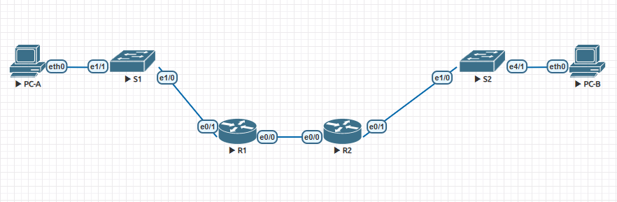

# Configure DHCPv6  

## Задачи:  
 1. Создать сеть на основе топологии и произвести базовые настройки;  
 2. Проверить назначения адреса SLAAC от R1;  
 3. Настройка и проверка Stateless DHCPv6 Server на R1;  
 4. Настройка  Statefull DHCPv6 Server на R1;
 5. Настройка и проверка DHCPv6 Relay на R2;  

 ## Конфигурации:  
   - [Конфигурация R1](config-R1v4);  
   - [Конфигурация S1](config-S1v4);  
   - [Конфигурация R2](config-R2v4);  
   - [Конфигурация S2](config-S2v4);  

# Решение:  
  1. Топология из задания:  
    
  Топология созданная в EVE-NG:  
    


Таблица адресов:  

| Device     | Interface Topology - EVE-NG  | IPv6 Address          |  
|:----------:|:----------------------------:|:---------------------:|  
| R1         | G0/0/0/ - E0/0               | 2001:db8:acad:2::1/64 |  
|            |                              | fe80::1               |  
|            | G0/0/1 - E0/1                | 2001:db8:acad:1::1/64 |  
|            |                              | fe80::1               |  
| R2         | G0/0/0 - E0/0                | 2001:db8:acad:2::2/64 |  
|            |                              | fe80::2               |  
|            | G0/0/1 - E0/1                | 2001:db8:acad:3::1/64 |  
|            |                              | fe80::1               |  
| PC-A       | NIC - NIC                    | DHCP                  |  
| PC-B       | NIC - NIC                    | DHCP                  |  

Настройка маршрутищзации и проверка связанности:  

```
R1(config)#ipv6 route ::/0  2001:db8:acad:2::2
R1(config)#ipv6 unicast-routing
R1#ping 2001:db8:acad:3::1
Type escape sequence to abort.
Sending 5, 100-byte ICMP Echos to 2001:DB8:ACAD:3::1, timeout is 2 seconds:
!!!!!
Success rate is 100 percent (5/5), round-trip min/avg/max = 1/4/18 ms
```  

```
R2(config)#ipv6 route ::/0  2001:db8:acad:2::1
R2(config)#ipv6 unicast-routing
R2#ping 2001:db8:acad:1::1
Type escape sequence to abort.
Sending 5, 100-byte ICMP Echos to 2001:DB8:ACAD:1::1, timeout is 2 seconds:
!!!!!
Success rate is 100 percent (5/5), round-trip min/avg/max = 1/1/1 ms
```  
2. Проверяем SLAAC:  

*PC-A=PC-win7

PC-1:  

  

3. Настройка Stateless DHCPv6 Server на R1:  

*PC-A=PC-win7  

R1:  

```
R1(config)# ipv6 dhcp pool R1-STATELESS
R1(config-dhcp)# dns-server 2001:db8:acad::254
R1(config-dhcp)# domain-name STATELESS.com
R1(config)# interface Ethernet0/1
R1(config-if)# ipv6 nd other-config-flag
R1(config-if)# ipv6 dhcp server R1-STATELESS
```  
Результат на PC-A:  

  

4. Настройка Statefull DHCPv6 Server на R1 для локальной сети R2:  

```
R1(config)# ipv6 dhcp pool R2-STATEFUL
R1(config-dhcp)# address prefix 2001:db8:acad:3:aaa::/80
R1(config-dhcp)# dns-server 2001:db8:acad::254
R1(config-dhcp)# domain-name STATEFUL.com
R1(config)# interface Ethernet0/0
R1(config-if)# ipv6 dhcp server R2-STATEFUL
```  
5. Настройка и проверка DHCPv6 Relay на R2:  

*PC-B=PC-win7  

SLAAC на PC-B:  

  

  

Настройка Relay на R2:  

```
R2(config)# interface Ethernet0/1
R2(config-if)# ipv6 nd managed-config-flag
R2(config-if)# ipv6 dhcp relay destination 2001:db8:acad:2::1 Ethernet0/0
```  
Провекра на PC-B:  

  
