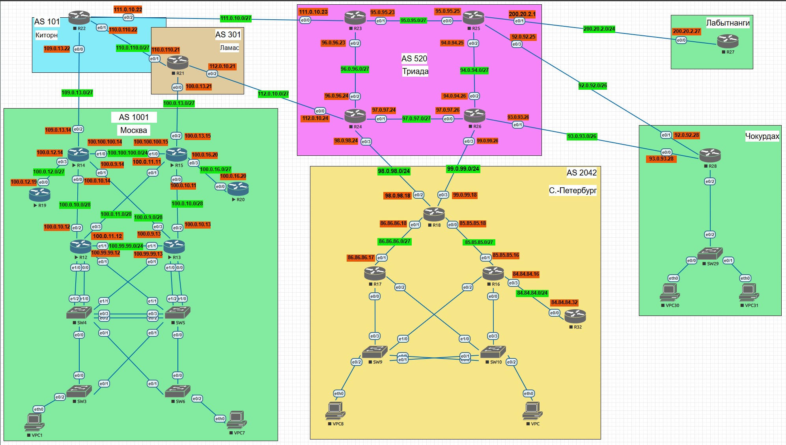

# Большая Лабораторная работа  

## Задачи:  
1. Разработаете и задокументируете адресное пространство для лабораторного стенда.  
2. Настроите ip адреса на каждом активном порту.  
3. Настроите каждый VPC в каждом офисе в своем VLAN.  
4. Настроите VLAN/Loopbackup interface управления для сетевых устройств.  
5. Настроите сети офисов так, чтобы не возникало broadcast штормов, а использование линков было максимально оптимизировано.  
6. Используете IPv4. IPv6 по желанию.  
7. Настроите политику маршрутизации для сетей офиса.  
8. Распределите трафик между двумя линками с провайдером.  
9. Настроите отслеживание линка через технологию IP SLA.(только для IPv4).  
10. Настройте для офиса Лабытнанги маршрут по-умолчанию.  

# Решение:  

1. Адресное пространство: 

Топология из задания:  
 

AS1001 (Москва):  
| Device     | Interface Topology | IP Address    | Subnet Mask     | Default Gateway  | LoopBack       | 
|:----------:|:------------------:|:-------------:|:---------------:|:----------------:|:--------------:|
| R12        | E0/0               | N/A           | N/A             | N/A              | 172.16.1.12/32 |
|            | E0/0.11            | 10.177.11.1   | 255.255.255.0   | N/A              |                |
|            | E0/1               | N/A           | N/A             | N/A              |                |
|            | E0/1.12            | 10.177.12.1   | 255.255.255.0   | N/A              |                |
|            | E0/2               | 100.0.10.12   | 255.255.255.240 | N/A              |                |
|            | E0/3               | 100.0.11.12   | 255.255.255.240 | N/A              |                |
|            | E1/0               | N/A           | N/A             | N/A              |                |
|            | E1/0.13            | 10.177.13.1   | 255.255.255.0   | N/A              |                |
|            |                    |               |                 |                  |                |
| R13        | E0/0               | N/A           | N/A             | N/A              | 172.16.1.13/32 |
|            | E0/0.11            | 10.177.11.2   | 255.255.255.0   | N/A              |                |
|            | E0/1               | N/A           | N/A             | N/A              |                |
|            | E0/1.12            | 10.177.12.2   | 255.255.255.0   | N/A              |                |
|            | E0/2               | 100.0.10.13   | 255.255.255.240 | N/A              |                |
|            | E0/3               | 100.0.9.13    | 255.255.255.240 | N/A              |                |
|            | E1/0               | N/A           | N/A             | N/A              |                |
|            | E1/0.13            | 10.177.13.2   | 255.255.255.0   | N/A              |                |
|            |                    |               |                 |                  |                |
| R14        | E0/0               | 100.0.10.14   | 255.255.255.240 | N/A              | 172.16.1.14/32 |
|            | E0/1               | 100.0.9.14    | 255.255.255.240 | N/A              |                |
|            | E0/2               | 109.0.13.14   | 255.255.255.224 | N/A              |                |
|            | E0/3               | 100.0.12.14   | 255.255.255.224 | N/A              |                |
|            |                    |               |                 |                  |                |
| R15        | E0/0               | 100.0.10.11   | 255.255.255.240 | N/A              | 172.16.1.15/32 |
|            | E0/1               | 100.0.11.11   | 255.255.255.240 | N/A              |                |
|            | E0/2               | 100.0.13.15   | 255.255.255.224 | N/A              |                |
|            | E0/3               | 100.0.16.15   | 255.255.255.224 | N/A              |                |
|            |                    |               |                 |                  |                |
| R19        | E0/0               | 100.0.12.19   | 255.255.255.224 | N/A              | 172.16.1.19/32 |
|            |                    |               |                 |                  |                |
| R20        | E0/0               | 100.0.16.20   | 255.255.255.224 | N/A              | 172.16.1.20    |
|            |                    |               |                 |                  |                |
| SW3        | VLAN11             | 10.177.11.3   | 255.255.255.0   | 10.177.11.254    | N/A            |
|            | VLAN12             | 10.177.12.3   | 255.255.255.0   | 10.177.11.254    | N/A            |
|            | VLAN13             | 10.177.13.3   | 255.255.255.0   | 10.177.11.254    | N/A            |
|            |                    |               |                 |                  |                |
| SW4        | VLAN11             | 10.177.11.4   | 255.255.255.0   | N/A              | N/A            |
|            | VLAN12             | N/A           | N/A             | N/A              | N/A            |
|            | VLAN13             | N/A           | N/A             | N/A              | N/A            |
|            |                    |               |                 |                  |                |
| SW5        | VLAN11             | 10.177.11.5   | 255.255.255.0   | N/A              | N/A            |
|            | VLAN12             | N/A           |                 | N/A              | N/A            |
|            | VLAN13             | N/A           |                 | N/A              | N/A            |
|            |                    |               |                 |                  |                |
| SW6        | VLAN11             | 10.177.11.6   | 255.255.255.0   | 10.177.11.254    | N/A            |
|            | VLAN12             | 10.177.12.6   | 255.255.255.0   | 10.177.11.254    | N/A            |
|            | VLAN13             | 10.177.13.6   | 255.255.255.0   | 10.177.11.254    | N/A            |
|            |                    |               |                 |                  |                |
| VPC-1      | NIC - NIC          | DHCP          | DHCP            | DHCP             |                |
| VPC-7      | NIC - NIC          | DHCP          | DHCP            | DHCP             |                |
|            |                    |               |                 |                  |                |  

VLAN Таблица:  
| VLAN | NAME       | Interface Assigned Topology - EVE-NG |
|:----:|:----------:|:------------------------------------:|
| 11   | Management | SW3-SW6: N/A                         |
| 12   | UserGroup1 | SW3: E0/2-3, E1/0-3                  |
| 13   | UserGroup2 | SW5: E0/2-3, E1/0-3                  |
| 3999 | Native     | N/A                                  |
|      |            |                                      |  


AS2042(Санкт-Питербург):  
| Device     | Interface Topology | IP Address    | Subnet Mask     | Default Gateway  | LoopBack       |
|:----------:|:------------------:|:-------------:|:---------------:|:----------------:|:--------------:|
| R16        | E0/0               | N/A           | N/A             | N/A              | 172.16.1.16/32 |
|            | E0/0.15            | 10.177.15.2   | 255.255.255.0   | N/A              |                |
|            | E0/1               | 85.85.85.16   | 255.255.255.224 | N/A              |                |
|            | E0/2               | N/A           | N/A             | N/A              |                |
|            | E0/2.14            | 10.177.14.2   | 255.255.255.0   | N/A              |                |
|            | E0/3               | 84.84.84.16   | 255.255.255.0   | N/A              |                |
|            |                    |               |                 |                  |                |
| R17        | E0/0               | N/A           | N/A             | N/A              | 172.16.1.17/32 |
|            | E0/0.14            | 10.177.14.1   | 255.255.255.0   | N/A              |                |
|            | E0/1               | 86.86.86.17   | 255.255.255.224 | N/A              |                |
|            | E0/2               | N/A           | N/A             | N/A              |                |
|            | E0/2.15            | 10.177.15.1   | 255.255.255.0   | N/A              |                |
|            |                    |               |                 |                  |                |
| R18        | E0/0               | 85.85.85.18   | 255.255.255.224 | N/A              | 172.16.1.18/32 |
|            | E0/1               | 86.86.86.18   | 255.255.255.224 | N/A              |                |
|            | E0/2               | 98.0.98.18    | 255.255.255.0   | N/A              |                |
|            | E0/3               | 99.0.99.18    | 255.255.255.0   | N/A              |                |
|            |                    |               |                 |                  |                |
| R32        | E0/0               | 84.84.84.32   | 255.255.255.0   | N/A              | 172.16.1.32/32 |
|            |                    |               |                 |                  |                |
| SW9        | VLAN14             | 10.177.14.9   | 255.255.255.0   | 10.177.14.254    | N/A            |
|            | VLAN15             | 10.177.15.9   | 255.255.255.0   | 10.177.14.254    | N/A            |
|            |                    |               |                 |                  |                |
| SW10       | VLAN14             | 10.177.14.10  | 255.255.255.0   | 10.177.14.254    | N/A            |
|            | VLAN15             | 10.177.15.10  | 255.255.255.0   | 10.177.14.254    | N/A            |
|            |                    |               |                 |                  |                |
| VPC        | NIC - NIC          | DHCP          | DHCP            | DHCP             |                |
| VPC-8      | NIC - NIC          | DHCP          | DHCP            | DHCP             |                |
|            |                    |               |                 |                  |                |  

VLAN Таблица:  
| VLAN | NAME       | Interface Assigned Topology - EVE-NG |
|:----:|:----------:|:------------------------------------:|
| 14   | Management | SW9: E0/2, E1/1-3                    |
| 15   | UserGroup1 | S10: E0/2, E1/1  -3                  |
| 3999 | Native     | N/A                                  |
|      |            |                                      |

AS301 (Ламас):
| Device     | Interface Topology | IP Address    | Subnet Mask     | Default Gateway  | LoopBack       |
|:----------:|:------------------:|:-------------:|:---------------:|:----------------:|:--------------:|
| R21        | E0/0               | 100.0.13.21   | 255.255.255.224 | N/A              | 172.16.1.21/32 |
|            | E0/1               | 110.0.110.21  | 255.255.255.224 | N/A              |                |
|            | E0/2               | 112.0.10.21   | 255.255.255.224 | N/A              |                |
|            |                    |               |                 |                  |                |  

AS101(Китрон):
| Device     | Interface Topology | IP Address    | Subnet Mask     | Default Gateway  | LoopBack       |
|:----------:|:------------------:|:-------------:|:---------------:|:----------------:|:--------------:|
| R22        | E0/0               | 109.0.13.22   | 255.255.255.224 | N/A              | 172.16.1.22/32 |
|            | E0/1               | 110.0.110.22  | 255.255.255.224 | N/A              |                |
|            | E0/2               | 111.0.10.22   | 255.255.255.224 | N/A              |                |
|            |                    |               |                 |                  |                |  

AS520(Триада):
| Device     | Interface Topology | IP Address    | Subnet Mask     | Default Gateway  | LoopBack       |
|:----------:|:------------------:|:-------------:|:---------------:|:----------------:|:--------------:|
| R23        | E0/0               | 111.0.10.23   | 255.255.255.224 | N/A              | 172.16.1.23/32 |
|            | E0/1               | 95.0.95.23    | 255.255.255.224 | N/A              |                |
|            | E0/2               | 96.0.96.23    | 255.255.255.224 | N/A              |                |
|            |                    |               |                 |                  |                |
| R24        | E0/0               | 112.0.10.24   | 255.255.255.224 | N/A              | 172.16.1.24/32 |
|            | E0/1               | 97.0.97.24    | 255.255.255.224 | N/A              |                |
|            | E0/2               | 96.0.96.24    | 255.255.255.224 | N/A              |                |
|            | E0/3               | 98.0.98.24    | 255.255.255.0   | N/A              |                |
|            |                    |               |                 |                  |                |
| R25        | E0/0               | 95.0.95.25    | 255.255.255.224 | N/A              | 172.16.1.25/32 |
|            | E0/1               | 200.20.2.1    | 255.255.255.0   | N/A              |                |
|            | E0/2               | 94.0.94.25    | 255.255.255.224 | N/A              |                |
|            | E0/3               | 92.0.92.25    | 255.255.255.192 | N/A              |                |
|            |                    |               |                 |                  |                |
| R26        | E0/0               | 97.0.97.26    | 255.255.255.224 | N/A              | 172.16.1.26/32 |
|            | E0/1               | 93.0.93.26    | 255.255.255.192 | N/A              |                |
|            | E0/2               | 94.0.94.26    | 255.255.255.224 | N/A              |                |
|            | E0/3               | 99.0.99.26    | 255.255.255.0   | N/A              |                |
|            |                    |               |                 |                  |                |  

Лабытанги:
| Device     | Interface Topology | IP Address    | Subnet Mask     | Default Gateway  | LoopBack       |
|:----------:|:------------------:|:-------------:|:---------------:|:----------------:|:--------------:|
| R27        | E0/0               | 200.20.2.27   | 255.255.255.0   | 200.20.2.1       | 172.16.1.27/32 |
|            |                    |               |                 |                  |                |  

Чокурдах:
| Device     | Interface Topology | IP Address    | Subnet Mask     | Default Gateway  | LoopBack       |
|:----------:|:------------------:|:-------------:|:---------------:|:----------------:|:--------------:|
| R28        | E0/0               | 93.0.93.28    | 255.255.255.192 | N/A              | 172.16.1.28/32 |
|            | E0/1               | 92.0.92.28    | 255.255.255.192 | N/A              |                |
|            | E0/2               | N/A           | N/A             | N/A              |                |
|            | E0/2.17            | 10.177.17.1   | 255.255.255.0   | N/A              |                |
|            | E0/2.18            | 10.177.18.1   | 255.255.255.0   | N/A              |                |
|            | E0/2.19            | 10.177.19.1   | 255.255.255.0   | N/A              |                |
|            |                    |               |                 |                  |                |
| SW29       | VLAN17             | 10.177.18.29  | 255.255.255.0   | 10.177.18.1      | N/A            |
|            | VLAN18             | N/A           | N/A             | N/A              | N/A            |
|            | VLAN19             | N/A           | N/A             | N/A              | N/A            |
| VPC-30     | NIC - NIC          | DHCP          | DHCP            | DHCP             |                |
| VPC-31     | NIC - NIC          | DHCP          | DHCP            | DHCP             |                |  

VLAN Таблица:  
| VLAN | NAME       | Interface Assigned Topology - EVE-NG |
|:----:|:----------:|:------------------------------------:|
| 17   | Management | SW29: E0/3                           |
| 18   | UserGroup1 | SW29: E0/0                           |
| 19   | UserGroup2 | SW29: E0/1                           |
| 3999 | Native     | N/A                                  |
|      |            |                                      |  


10. Маршрут по умолчанию для офиса Лабытанги:  

```
R27(config)#do sh ip route
Codes: L - local, C - connected, S - static, R - RIP, M - mobile, B - BGP
       D - EIGRP, EX - EIGRP external, O - OSPF, IA - OSPF inter area
       N1 - OSPF NSSA external type 1, N2 - OSPF NSSA external type 2
       E1 - OSPF external type 1, E2 - OSPF external type 2
       i - IS-IS, su - IS-IS summary, L1 - IS-IS level-1, L2 - IS-IS level-2
       ia - IS-IS inter area, * - candidate default, U - per-user static route
       o - ODR, P - periodic downloaded static route, H - NHRP, l - LISP
       a - application route
       + - replicated route, % - next hop override

Gateway of last resort is 200.20.2.1 to network 0.0.0.0

S*    0.0.0.0/0 [1/0] via 200.20.2.1
      200.20.2.0/24 is variably subnetted, 2 subnets, 2 masks
C        200.20.2.0/24 is directly connected, Ethernet0/0
L        200.20.2.27/32 is directly connected, Ethernet0/0
```  

